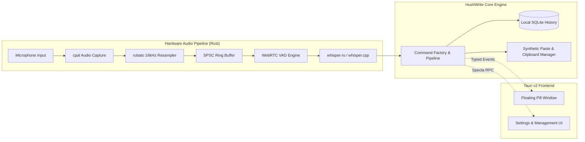

<div align="center">

# HushWrite

**High-performance, zero-cloud speech-to-text for macOS and Windows.**  
_Local inference with sub-300ms latency, native system injection, and strict data sovereignty._

[](LICENSE)
[](https://github.com/alexgutscher26/HushWrite)
[](https://tauri.app)
[](https://www.rust-lang.org)
[](https://react.dev)
[](PRIVACY.md)

[Overview](#overview) • [Key Features](#key-features) • [Comparison](#comparison) • [Architecture](#architecture) • [Installation](#installation) • [Developer Guide](#developer-guide) • [Security & Privacy](#security--privacy) • [Contributors](#community--contributors) • [Documentation](#documentation) • [License](#license)

</div>

---

## Overview

**HushWrite** is an open-source, local-first speech-to-text application engineered for high-throughput transcription, low latency, and complete user privacy. Unlike cloud-dependent dictation services that stream audio over external networks, HushWrite executes speech recognition entirely on local hardware using quantized, hardware-accelerated `whisper.cpp` engines.

The application requires no user accounts, has no recurring subscriptions, imposes no usage caps, and enforces a strict zero-egress data boundary.

---

## Key Features

- **Low-Latency Streaming Inference (`p50 < 300ms`)**  
  Processes audio streams concurrently using chunked VAD (Voice Activity Detection) and incremental decoding, delivering instantaneous text delivery upon releasing the hotkey.

- **Global Shortcuts and Peripheral Triggers**  
  Triggerable across any application via configurable shortcuts (`⌥ Space` on macOS, `Alt+Space` on Windows). Supports hold-to-talk, toggle modes, secondary bindings, and auxiliary mouse buttons (Middle Click, Mouse 4 / 5).

- **Non-Intrusive Floating Pill Overlay**  
  Displays real-time audio waveforms, decibel levels, and live partial transcriptions via an obsidian glass overlay window that never steals system focus or disrupts mouse interaction.

- **Synthetic Keystroke Injection & Clipboard Preservation**  
  Injects transcribed text directly at the active caret in any target application (IDEs, terminals, word processors, chat clients) and automatically restores pre-existing clipboard contents.

- **Interactive Cancellation and Resume**  
  Abort recordings instantly with `Escape` or `Option/Alt+Escape` with a visual countdown indicator. Pressing the cancel trigger again restores the session without dropping audio buffers.

- **Multilingual Support & Automatic Language Detection**  
  Transcribe across 99 languages supported by Whisper models, with automatic language identification or manual dialect locking.

- **Custom Vocabulary Biasing & Text Normalization**  
  Define domain-specific terminology, code identifiers, acronyms, and phonetic substitutions to guide acoustic model decoding and normalize generated text.

- **Application-Specific Profiles**  
  Configure distinct formatting rules, hotkeys, and vocabulary biases tailored to specific target applications (e.g., Markdown rules for Obsidian, code-casing rules for VS Code).

- **Local SQLite History & Performance Observability**  
  All session metadata, latency metrics (`p50` / `p95`), and word counts are indexed locally in SQLite for rapid full-text search. Includes a one-click Incognito mode.

- **Hardware Acceleration**  
  Native Apple Silicon Metal acceleration on macOS; DirectML (DirectX 12), CUDA, and Vulkan backends on Windows.

---

## Comparison

| Dimension | HushWrite | Cloud Solutions (e.g. Wispr Flow) | Proprietary Local Tools |
| :--- | :--- | :--- | :--- |
| **Privacy Architecture** | **100% Local / Zero Egress** | Remote WebSocket audio streaming | Closed-source binary |
| **Platform Support** | **macOS & Windows** | Web / Limited Desktop | Mostly macOS only |
| **Inference Latency** | **Streaming (`p50 < 300ms`)** | Network-dependent (~1.5s - 3.0s) | Post-speech batch (~1.0s - 4.0s) |
| **Licensing** | **Open Source (MIT)** | Monthly subscription ($10 - $20/mo) | Commercial paid license |
| **Usage Limits** | **Unlimited** | Tiered quotas and word caps | Tiered feature gates |
| **Clipboard Preservation**| **Automated restoration** | Overwrites clipboard | Inconsistent |
| **Extensibility** | **Rust + Tauri v2 + React 19** | Closed SaaS | Proprietary architecture |

---

## Architecture

HushWrite pairs a high-throughput, lock-free Rust audio pipeline with a sandboxed Tauri v2 desktop shell:



### Architectural Principles

1. **Centralized Registry (`src-tauri/src/registry/`)**: Single source of truth declaring all capabilities, user settings, hotkey triggers, permissions, and telemetry metrics.
2. **Command Factory (`src-tauri/src/ipc/factory.rs`)**: Unified gateway for all IPC interactions, handling schema validation, permission checks, reentrancy guards, tracing, and structured error propagation.
3. **Type-Safe Specta Bindings**: Rust definitions automatically generate TypeScript contracts (`src/lib/bindings.ts`), eliminating manual IPC type synchronization.

---

## Installation

### Windows

#### Option A: Windows Package Manager (WinGet)

```powershell
winget install WebProdigies.HushWrite
```

#### Option B: Standalone Installer

Download the latest `.msi` or `.exe` installer from [GitHub Releases](https://github.com/alexgutscher26/HushWrite/tags).

---

### macOS

1. Download the latest Universal `.dmg` from [GitHub Releases](https://github.com/alexgutscher26/HushWrite/tags).
2. Open the `.dmg` and drag **HushWrite** to `/Applications`.
3. Grant **Microphone** and **Accessibility** permissions on first launch.

---

## Developer Guide

### Prerequisites

- **macOS**: macOS 13 (Ventura) or later (Apple Silicon or Intel x86_64).
- **Windows**: Windows 10/11 (64-bit).
- **Tooling**:
  - [Rust](https://rustup.rs/) (stable toolchain)
  - [Node.js](https://nodejs.org/) (v20+) or [Bun](https://bun.sh/)
  - [pnpm](https://pnpm.io/) or `bun`
  - C++ Build Tools (Xcode Command Line Tools on macOS, Visual Studio C++ Build Tools on Windows)

---

### Development Setup

```bash
# Clone the repository
git clone https://github.com/alexgutscher26/HushWrite.git
cd HushWrite

# Install dependencies
bun install   # or: pnpm install

# Start the desktop application in development mode
bun run tauri dev # or: pnpm tauri dev
```

---

### Windows Performance Configuration

To maintain real-time decoding performance during development on Windows, C++ dependencies are compiled with level-3 optimization in `src-tauri/Cargo.toml`:

```toml
[profile.dev.package."*"]
opt-level = 3
```

---

### Source-of-Truth Navigation (`sot`)

HushWrite utilizes a header-based indexing system for rapid code navigation:

```bash
# Search files associated with a specific symbol or concept
bun run sot SessionState

# Print header blocks and architectural context
bun run sot:show AudioChunk

# Validate repository adherence to SOT conventions
bun run sot:validate
```

---

### Testing and Verification

```bash
# Run Rust unit and integration tests
cargo test --manifest-path src-tauri/Cargo.toml

# Run TypeScript typechecks
bun run typecheck

# Validate Rust code formatting and lints
cargo clippy --manifest-path src-tauri/Cargo.toml --all-targets -- -D warnings
```

---

### Production Build

```bash
bun run tauri:build
```

Generated packages will be located in `src-tauri/target/release/bundle/`:
- **macOS**: `.app` and `.dmg`
- **Windows**: `.msi` and `.exe`

---

## Security & Privacy

| Permission | Purpose | Failure Mode if Denied |
| :--- | :--- | :--- |
| **Microphone** | Audio capture during dictation. | Dictation cannot operate (Required). |
| **Accessibility** | Direct caret text injection via simulated paste. | Transcribed text is copied to clipboard for manual paste. |

For detailed information regarding our data boundaries, threat model, and vulnerability disclosure policies, see:
- [Security Policy](SECURITY.md)
- [Privacy Architecture](PRIVACY.md)

---

## Community & Contributors

HushWrite thrives on community contributions from developers, clinicians, lawyers, writers, and language model enthusiasts worldwide.

- Read our list of maintainers and contributors in [**`CONTRIBUTORS.md`**](CONTRIBUTORS.md).
- To contribute code, report bugs, or share voice packs, check out [**`CONTRIBUTING.md`**](CONTRIBUTING.md) and our [GitHub Issue Templates](.github/ISSUE_TEMPLATE).
- Join our [Discord Community](https://discord.gg/HushWrite) for live discussions and beta testing.

---

## Documentation

- [`docs/00-START-HERE.md`](docs/00-START-HERE.md) — Architectural overview and onboarding.
- [`docs/01-IDEATION.md`](docs/01-IDEATION.md) — Product specifications and functional requirements.
- [`docs/02-TECHNICAL-PLAN.md`](docs/02-TECHNICAL-PLAN.md) — Low-level engineering design and latency budgets.
- [`docs/03-IMPLEMENTATION-NOTES.md`](docs/03-IMPLEMENTATION-NOTES.md) — Audio thread safety, Whisper configuration, and platform notes.
- [`docs/04-DESIGN-SYSTEM.md`](docs/04-DESIGN-SYSTEM.md) — Design tokens, typography, colors, and motion guidelines.
- [`docs/05-PROJECT-STRUCTURE.md`](docs/05-PROJECT-STRUCTURE.md) — Directory conventions and module structure.
- [`docs/06-CONVENTIONS-AND-GREP.md`](docs/06-CONVENTIONS-AND-GREP.md) — SOT header standards and search rules.
- [`CLAUDE.md`](CLAUDE.md) — Core engineering rules and development invariants.

---

## License

HushWrite is open-source software licensed under the [MIT License](LICENSE).
