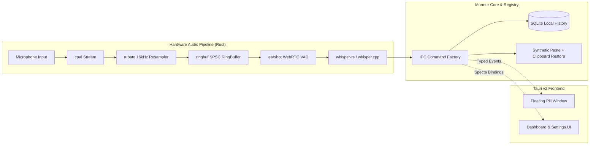

<div align="center">

# 🎙️ Murmur

**Instant, 100% private, local speech-to-text for macOS & Windows.**  
*Press a hotkey, speak naturally, release — your words are transcribed and pasted before you can look up.*

[](LICENSE)
[](https://github.com/alexgutscher26/murmur)
[](https://tauri.app)
[](https://www.rust-lang.org)
[](https://react.dev)
[](docs/badges.md)
[](docs/badges.md)

[Features](#-key-features) • [Why Murmur?](#-why-murmur) • [Architecture](#-architecture) • [Installation](#-installation--downloads) • [Developer Guide](#-developer-guide) • [Community Badges](#-community-badges) • [License](#-license)

</div>

---

## ⚡ What is Murmur?

**Murmur** is an open-source, local-first dictation tool built for speed, privacy, and seamless workflow integration. Unlike cloud speech-to-text tools that record audio, stream it across the internet, and make you wait seconds for a response, Murmur processes speech directly on your hardware using optimized `whisper.cpp` models.

No accounts, no monthly cloud subscriptions, no word limits, and **zero audio ever leaves your machine**.

---

## ✨ Key Features

- ⚡ **Flat, Real-Time Latency (`p50 < 300ms`)**  
  Transcribes continuously while you speak instead of waiting for you to finish. Finishing a 5-minute stream of thought is just as instantaneous as a 5-second sentence.
- ⌨️ **Global Hotkeys & Mouse Triggers**  
  Trigger anywhere with `⌥ Space` (macOS) or `Alt+Space` (Windows). Supports hold-to-talk, toggle mode, secondary keyboard shortcuts, and auxiliary mouse buttons (Middle Click, Mouse 4 / 5). Double-tap initiates rapid priority dictation.
- 💊 **Minimal Floating Pill Overlay**  
  A sleek, non-intrusive obsidian glass pill displays real-time audio waveforms, volume levels, and streaming transcription without ever stealing window focus or blocking clicks.
- 📋 **Direct Synthetic Paste & Clipboard Restoration**  
  Injects transcribed text directly into whichever application has focus (VS Code, Cursor, Obsidian, Slack, Terminal, browser) and automatically restores your prior clipboard content.
- 🛑 **Graceful Escape & Cancel**  
  Hit `Escape` or `Option/Alt+Escape` to cancel with an interactive 3-second countdown. Pressing `Escape` again instantly resumes the recording without losing audio.
- 🌐 **99 Languages & Auto-Detection**  
  Transcribe in nearly any language supported by OpenAI Whisper, automatically detected or pinned to your preferred dialect.
- 📖 **Custom Vocabulary & Biasing**  
  Train Murmur on technical jargon, programming identifiers, unusual names, and domain-specific acronyms to both bias recognition and normalize output.
- 🎛️ **Per-App Overrides & Profiles**  
  Customize dictation hotkeys, vocabulary, and formatting profiles tailored specifically for code editors, chat clients, or document editors.
- 🔍 **Searchable SQLite History & Honest Telemetry**  
  Every dictation is indexed locally in SQLite. Easily search previous thoughts, monitor word counts, and review real achieved latency metrics (`p50` / `p95`).
- 🚀 **Hardware Acceleration**  
  Native Apple Silicon Metal & Core ML on macOS; DirectML (DirectX 12), CUDA, and Vulkan on Windows.

---

## 📊 Why Murmur? (Comparison)

| Feature | Murmur | Cloud Dictation (Wispr Flow, etc.) | MacWhisper / Superwhisper |
| :--- | :---: | :---: | :---: |
| **Privacy / Audio Egress** | **100% On-Device (Zero Egress)** | Audio sent to cloud APIs | Often on-device, but closed-source |
| **Cross-Platform** | **macOS & Windows** | Web / Limited desktop | Mostly macOS only |
| **Inference Latency** | **Streaming (`p50 < 300ms`)** | Network lag (~1.5s – 3.0s) | Post-speech batch decode (~1s–5s) |
| **Price** | **Free & Open Source (MIT)** | $10 – $20 / month | $30+ paid license or subscription |
| **Audio / Word Limits** | **Unlimited** | Tiered quotas / monthly caps | Model-gated |
| **Clipboard Restoration** | **Yes (Preserved)** | Often overwrites clipboard | Inconsistent |
| **Extensible Architecture** | **Tauri v2 + Rust + React 19** | Closed SaaS | Proprietary closed binary |

---

## 🏗️ Architecture

Murmur combines a high-performance, low-latency Rust audio pipeline with a modern Tauri v2 desktop container.



### Core Architecture Highlights
1. **The Registry (`src-tauri/src/registry/`)**: Single source of truth defining every capability, setting, hotkey, permission, and metric.
2. **The Command Factory (`src-tauri/src/ipc/factory.rs`)**: Single entry point for all IPC commands, enforcing validation schemas, permission preflights, reentrancy guards, error mapping, and tracing.
3. **Type-Safe IPC (`tauri-specta`)**: Rust types automatically generate `src/lib/bindings.ts` on test/build. No manual DTO sync or hand-written TypeScript IPC wrappers.

---

## 📦 Installation & Downloads

### Windows

#### Option A: Windows Package Manager (WinGet)
```powershell
winget install WebProdigies.Murmur
```

#### Option B: Standalone Installer
Download the latest `.msi` or `.exe` installer from [GitHub Releases](https://github.com/alexgutscher26/murmur/releases).

---

### macOS

1. Download the latest Universal `.dmg` from [GitHub Releases](https://github.com/alexgutscher26/murmur/releases).
2. Open the `.dmg` and drag **Murmur** into your `/Applications` folder.
3. Grant **Microphone** and **Accessibility** permissions on initial launch.

---

## 🛠️ Developer Guide

### System Requirements
- **macOS**: macOS 13 (Ventura) or later (Apple Silicon M-series or Intel x86_64).
- **Windows**: Windows 10/11 (64-bit).
- **Tooling**:
  - [Rust](https://rustup.rs/) (stable toolchain)
  - [Node.js](https://nodejs.org/) (v18+) or [Bun](https://bun.sh/)
  - [pnpm](https://pnpm.io/) or `bun`
  - C++ build tools (Xcode Command Line Tools on macOS, Visual Studio C++ Build Tools on Windows)
- ~200MB – 600MB disk space for local GGML Whisper weights (`small-q5_1` default).

---

### Running in Development

Clone the repository and install dependencies:

```bash
git clone https://github.com/alexgutscher26/murmur.git
cd murmur

# Install frontend dependencies
pnpm install   # or: bun install

# Start the Tauri development desktop app
pnpm tauri dev # or: bun run tauri dev
```

> **First Launch Setup:** Murmur opens a guided onboarding window to request microphone access, download your preferred starting Whisper model, and test your global hotkey. Afterwards, Murmur minimizes to your system tray / menu bar.

---

### Windows Performance Optimization

In debug builds on Windows, raw unoptimized C++ compilation of Whisper dependencies can cause high inference latencies. Murmur's `src-tauri/Cargo.toml` overrides dependencies in dev profile:

```toml
[profile.dev.package."*"]
opt-level = 3
```

This ensures `whisper-rs-sys` and `rubato` run with native optimizations even during `tauri dev`, maintaining a real-time factor `< 0.3x`.

---

### Source-of-Truth Navigation (`pnpm sot`)

Murmur enforces strict `SOURCE OF TRUTH KEYWORDS` headers across the codebase. You can search symbols and architecture components instantly without scanning the entire file tree:

```bash
# Find files owning a specific symbol or concept
pnpm sot SessionState

# Display file headers and architectural context
pnpm sot:show AudioChunk

# Validate that all project files adhere to SOT conventions
pnpm sot:validate
```

---

### Testing & Typecheck

```bash
# Run Rust tests and regenerate TypeScript bindings via tauri-specta
cargo test --manifest-path src-tauri/Cargo.toml

# Typecheck TypeScript and React components
pnpm typecheck
```

---

### Building for Production

```bash
pnpm tauri build
```

The resulting binaries will be placed in `src-tauri/target/release/bundle/`:
- **macOS**: `.app` and `.dmg`
- **Windows**: `.msi` and `.exe`

#### Signing Updater Archives (Optional)
To sign release updater archives with your private key:

```bash
TAURI_SIGNING_PRIVATE_KEY="$(cat ~/.murmur-updater.key)" \
TAURI_SIGNING_PRIVATE_KEY_PASSWORD="" \
  pnpm tauri build
```

---

## 🔒 Permissions & Privacy Model

| Permission | Why It's Needed | Fallback if Denied |
| :--- | :--- | :--- |
| **Microphone** | Audio capture during dictation. | Dictation cannot operate. (Required) |
| **Accessibility** | Simulates `⌘V` / `Ctrl+V` to paste text into the active window. | Text is cleanly copied to the system clipboard for manual pasting. |

> [!NOTE]  
> **macOS Code Signing & Accessibility:**  
> macOS binds Accessibility permissions to the app's bundle identifier *and* its cryptographic signature. In development, ad-hoc signatures change on rebuild, causing macOS to occasionally require re-granting Accessibility. This does not occur in distributed release builds. Refer to `docs/03 §3.4` for details on configuring a local development certificate.

### Zero Network Egress Guarantee
Murmur does **not** collect telemetry, user recordings, or text snippets. The only optional network interactions are:
1. One-time GGML model download during onboarding or when switching models in Settings.
2. Optional automated check for app updates via GitHub Releases.  
Both can be audited, monitored, or disabled entirely.

---

## 🏷️ Community Badges

Showcase your local, private AI dictation workflow in your open-source projects, pull requests, and documentation.

### Shields.io Markdown Badges

```markdown
<!-- Flat Square Badge -->
[](https://github.com/alexgutscher26/murmur)

<!-- 100% Local Privacy Badge -->
[](https://github.com/alexgutscher26/murmur)
```

### Pull Request & Issue Footer
```markdown
---
_Dictated privately on-device with [Murmur](https://github.com/alexgutscher26/murmur)_
```

*(For full badge options, HTML embeds, and voice-triggered templates, see [`docs/badges.md`](docs/badges.md).)*

---

## 📚 Documentation Index

- [`docs/00-START-HERE.md`](docs/00-START-HERE.md) — Onboarding and architectural orientation.
- [`docs/01-IDEATION.md`](docs/01-IDEATION.md) — Product requirements, feature breakdown, and scope.
- [`docs/02-TECHNICAL-PLAN.md`](docs/02-TECHNICAL-PLAN.md) — Technology stack, system design, and latency budgets.
- [`docs/03-IMPLEMENTATION-NOTES.md`](docs/03-IMPLEMENTATION-NOTES.md) — Audio thread safety, Whisper configuration, and platform quirks.
- [`docs/04-DESIGN-SYSTEM.md`](docs/04-DESIGN-SYSTEM.md) — Design tokens, color palette, glass materials, and motion specs.
- [`docs/05-PROJECT-STRUCTURE.md`](docs/05-PROJECT-STRUCTURE.md) — Directory layout and structural conventions.
- [`docs/06-CONVENTIONS-AND-GREP.md`](docs/06-CONVENTIONS-AND-GREP.md) — SOT header system and rapid navigation guidelines.
- [`CLAUDE.md`](CLAUDE.md) — Codebase engineering rules and invariants.

---

## 📄 License

Murmur is distributed under the [MIT License](LICENSE).
