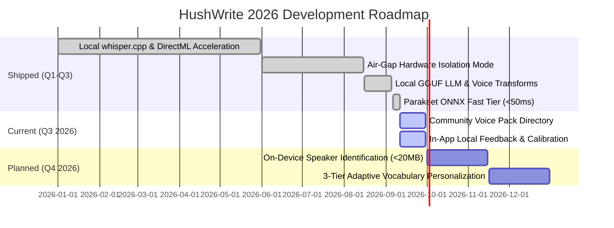

# HushWrite Public Feature Roadmap

> **Data Sovereignty Promise:** Every feature on this roadmap is engineered to run 100% locally on-device with zero cloud telemetry.

Welcome to the public roadmap for **HushWrite**. This document tracks planned capabilities, current work in progress, and shipped milestones.

---

## Roadmap Overview

---

## 🚀 Shipped Milestones

### Core Speech & AI Architecture

- [x] **100% Local Inference**: Zero-egress `whisper.cpp` engine with Apple Silicon Metal and Windows DirectML/CUDA acceleration.
- [x] **Sub-300ms p50 Streaming**: Lock-free audio ring buffer with chunked WebRTC VAD and real-time audio pipeline.
- [x] **NVIDIA Parakeet ONNX Fast Tier**: Sub-50ms streaming English dictation and sub-25ms hotkey command responses via FastConformer & TDT/CTC.
- [x] **Dual-Engine Speech Recognition**: Intelligent routing dispatching English to Parakeet (<50ms) and 99-language audio to Whisper.
- [x] **Local GGUF LLM Smart Cleanup**: Integrated `Qwen/Qwen2.5-1.5B-Instruct-GGUF` and `microsoft/Phi-3.5-mini-instruct-gguf` via `llama-cpp-2` for sub-second filler stripping, grammar enhancement, and natural spoken transforms ("_Hey HushWrite, make that formal_").
- [x] **Hardware Auto-Quantization**: Automatic selection of `Q4_K_M` for CPU laptops and `Q5_K_M`/`Q6_K` for high-core workstations and GPUs.

### UI, Overlay & Privacy

- [x] **Obsidian Floating Glass Pill**: Click-through, non-focus-stealing floating indicator with dynamic waveform visualizer and notch modes.
- [x] **Synthetic Keystroke Injection & Clipboard Restoration**: Caret paste across IDEs, browsers, terminals, and chat clients.
- [x] **Air-Gap Hardware Isolation Mode**: Instant software socket isolation with localhost-only client bindings.
- [x] **Local SQLite Observability & Incognito Mode**: Fully encrypted local history with session latency tracking (`p50`/`p95`).
- [x] **Community & Contributor Systems**: Standardized GitHub Issue forms, PR templates, and `CONTRIBUTORS.md` sync.

---

## 🔨 In Progress (Q3 2026)

- [ ] **Community Voice Pack Directory (`packs/`)**: Centralized repository of domain-specific phonetic dictionaries and macros (Medical SOAP, Legal Brief, TypeScript/Rust Dev, Substack Writing).
- [ ] **User Feedback Widget**: Non-intrusive in-app satisfaction ratings stored in local SQLite without cloud transmission.
- [ ] **Public Open Beta Program**: Canary and pre-release distribution channels with dedicated Discord beta triage.

---

## 🔮 Upcoming Backlog (Q4 2026 & Beyond)

### Machine Learning & Acoustic Personalization

- [ ] **On-Device Speaker Identification (<20MB)**: Lightweight embedding model (SpeakerNet / ECAPA-TDNN) to identify 2–5 enrolled speakers without cloud processing.
- [ ] **3-Tier Adaptive Vocabulary Personalization**:
  1. Dynamic TF-IDF & recency prompt prefix biasing (<200 tokens).
  2. Local LLM glossary injection.
  3. Opt-in offline background acoustic LoRA ($r=8$) fine-tuning on AC power with anchor regularization.
- [ ] **Active Noise Cancellation Pre-Filter**: Real-time 90KB RNNoise pre-filter before Whisper encoder to improve noisy room WER by 15–20%.
- [ ] **Multimodal Context Injection**: Optional local screenshot OCR context passed to the LLM post-processing pass for visual context inference.

### Ecosystem & Multi-Platform

- [ ] **macOS Official Universal Binary**: Signed and notarized `.dmg` package for macOS Apple Silicon (M1–M4) and Intel.
- [ ] **Linux (Experimental)**: `x86_64` AppImage with PipeWire capture and `ydotool`/`xdotool` synthetic input injection.
- [ ] **In-App Searchable Help Docs**: Offline markdown documentation viewer embedded directly in the dashboard (`?` shortcut).

---

## Proposing New Features

Have an idea for HushWrite?

1. Check existing proposals in our [GitHub Discussions](https://github.com/alexgutscher26/HushWrite/discussions).
2. Submit a feature proposal via our [Feature Request Template](.github/ISSUE_TEMPLATE/feature_request.yml).
3. Join the discussion in `#feature-requests` on our [Discord Community](https://discord.gg/s95VtQv33m).
