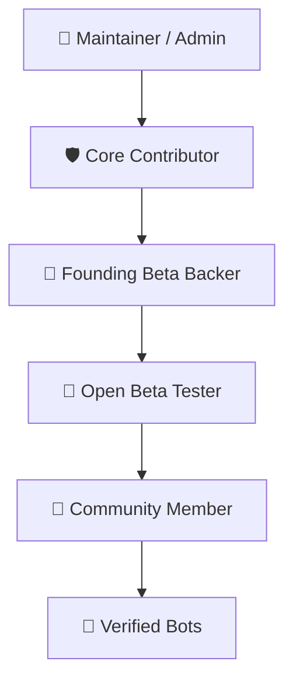

# HushWrite Community Discord Server Blueprint & Setup Guide

This document defines the complete structure, channel layout, role hierarchies, bot integrations, onboarding flows, and moderation rules for the official **HushWrite Discord Community**.

---

## 1. Server Metadata

- **Server Name**: HushWrite | Local-First AI Voice Dictation
- **Server Description**: The official community for HushWrite users, speech AI researchers, open-source contributors, and domain voice pack creators.
- **Server Icon**: HushWrite Obsidian Mark (`assets/128x128@2x.png`)
- **Server Banner**: Minimalist obsidian wave with glassmorphic typography
- **Vanity URL / Invite**: `https://discord.gg/s95VtQv33m`

---

## 2. Channel Architecture & Categories

### 📌 `1. START HERE` (Read-Only)

| Channel              | Purpose                                                                                                       | Permissions                                |
| :------------------- | :------------------------------------------------------------------------------------------------------------ | :----------------------------------------- |
| `#welcome-and-rules` | Plain-English community guidelines, privacy expectations, and server overview.                                | `@everyone` (View Only)                    |
| `#announcements`     | Major software releases, security bulletins, model catalog additions, and project milestones.                 | `@everyone` (View Only, Reactions Enabled) |
| `#roles-and-access`  | Reaction/Button-based self-assignable roles (e.g. OS, Beta Tester, Voice Pack Creator).                       | `@everyone` (Interact via Buttons)         |
| `#get-hushwrite`     | Official download links for Windows (Microsoft Store / MSI / EXE), macOS Early Access, and SHA-256 checksums. | `@everyone` (View Only)                    |
| `#public-roadmap`    | Synchronized monthly development milestones and feature status from `TODO.md` & GitHub Projects.              | `@everyone` (View Only)                    |

---

### 💬 `2. COMMUNITY & WORKFLOWS`

| Channel                   | Purpose                                                                                                        | Permissions                                     |
| :------------------------ | :------------------------------------------------------------------------------------------------------------- | :---------------------------------------------- |
| `#general-chat`           | General discussion on local AI dictation, daily workflows, productivity, and desktop setups.                   | `@Community Member` (Send Messages)             |
| `#showcase-and-packs`     | Share custom domain voice packs (Medical, Legal, Coding, Creative), YAML configurations, and dictation demos.  | `@Community Member` (Embed Links, Upload Media) |
| `#hardware-and-gpus`      | Discussions on VRAM allocation, DirectML vs CUDA, Apple Silicon Metal optimization, and latency benchmarks.    | `@Community Member` (Send Messages)             |
| `#prompts-and-transforms` | Exchange natural language prompts and ChatML instructions for GGUF voice transformations (Qwen 2.5 & Phi-3.5). | `@Community Member` (Send Messages)             |

---

### 🧪 `3. OPEN BETA PROGRAM & FEEDBACK`

| Channel               | Purpose                                                                                                    | Permissions                           |
| :-------------------- | :--------------------------------------------------------------------------------------------------------- | :------------------------------------ |
| `#beta-announcements` | Changelogs and download links for experimental canary/nightly and beta builds.                             | `@Beta Tester` (View Only)            |
| `#beta-feedback`      | Dedicated channel for active beta testers to report real-world experience, accuracy drift, and ergonomics. | `@Beta Tester` (Send Messages)        |
| `#feature-requests`   | Structured forum for proposing new capabilities, model integrations, and UX enhancements.                  | `@Community Member` (Forum Post Mode) |
| `#bug-reports`        | Triage channel linked to GitHub Issue templates. Requires reproduction steps, OS, and active model.        | `@Community Member` (Forum Post Mode) |

---

### 🛠️ `4. ENGINEERING & OPEN SOURCE`

| Channel                 | Purpose                                                                                                     | Permissions                          |
| :---------------------- | :---------------------------------------------------------------------------------------------------------- | :----------------------------------- |
| `#dev-general`          | Technical architecture discussion (Rust pipeline, Tauri v2 IPC, SOT headers, React 19 UI).                  | `@Contributor` & `@Community Member` |
| `#speech-ai-and-models` | Model engineering: ONNX Runtime FastConformer, Parakeet TDT/CTC, Whisper GGML quantizations, and GGUF LLMs. | `@Community Member` (Send Messages)  |
| `#github-feed`          | Automated webhook stream of new issues, pull requests, releases, and CI build results.                      | `@everyone` (View Only)              |
| `#pr-reviews`           | Coordination for community PRs, architectural review requests, and testing verification receipts.           | `@Contributor` (Send Messages)       |

---

### 🔒 `5. SECURITY & AIR-GAP`

| Channel                   | Purpose                                                                              | Permissions                         |
| :------------------------ | :----------------------------------------------------------------------------------- | :---------------------------------- |
| `#privacy-and-compliance` | Discussions on HIPAA, GDPR, Attorney-Client privilege, and zero-telemetry auditing.  | `@Community Member` (Send Messages) |
| `#security-bulletins`     | Official disclosure updates and hash verification logs for signed release artifacts. | `@everyone` (View Only)             |

---

## 3. Role Hierarchy & Permission Matrix



### Role Specifications

1. **👑 Maintainer (`#10B981`)**
   - Project leads and repository admins. Full server management, announcement publishing, release verification.
2. **🛡️ Core Contributor (`#6366F1`)**
   - Active code and model contributors recognized in [`CONTRIBUTORS.md`](../CONTRIBUTORS.md). Access to private triage & dev planning.
3. **💎 Founding Beta (`#EC4899`)**
   - Lifetime backers and early commercial supporters. Access to VIP lounge, priority feedback channels, and early preview builds.
4. **🧪 Open Beta Tester (`#F59E0B`)**
   - Community members testing canary and pre-release builds. Notified for targeted test suites.
5. **🌿 Community Member (`#94A3B8`)**
   - Default role granted upon accepting server rules. Standard messaging access across community channels.
6. **Operating System Vanity Roles (Self-Selectable)**:
   - 🪟 `Windows User` (DirectML, MSIX, Windows 10/11)
   - 🍎 `macOS User` (Apple Silicon, Metal, Sonoma/Sequoia)
   - 🐧 `Linux User` (PipeWire, Wayland, Custom builds)

---

## 4. Bot Integrations & Automation

### 1. GitHub Webhook Integration

- **Target Channel**: `#github-feed`
- **Events**:
  - `push` to `main`
  - `pull_request` (opened, closed, merged)
  - `issues` (opened, labeled)
  - `release` (published)

### 2. Auto-Moderation & Privacy Protection Rule

- **Filter**: Block any attempt to post raw API keys (`sk-...`), AWS credentials, or unauthorized telemetry links.
- **Rule**: Remind users never to paste sensitive audio samples or unvetted log dumps in public channels.

### 3. Role-Selection Bot (e.g. Carl-bot or Discohook)

- Configured in `#roles-and-access` with interactive button clicks:
  - `[🪟 Windows]` → Grants `@Windows User`
  - `[🍎 macOS]` → Grants `@macOS User`
  - `[🧪 Join Open Beta]` → Grants `@Open Beta Tester`
  - `[📦 Voice Pack Creator]` → Grants `@Voice Pack Creator`

---

## 5. Community Voice Pack Directory Setup (`HushWrite-community/packs`)

To support domain-specific voice packs mentioned in the roadmap:

1. **Repository Structure**:
   ```
   HushWrite-community/packs/
   ├── legal/
   │   ├── litigation-briefs.json
   │   └── README.md
   ├── medical/
   │   ├── clinical-soap-notes.json
   │   └── README.md
   ├── engineering/
   │   ├── typescript-rust-dev.json
   │   └── README.md
   └── schema.json
   ```
2. **Voice Pack JSON Schema**:
   ```json
   {
     "name": "TypeScript & Rust Engineering",
     "author": "github_username",
     "version": "1.0.0",
     "description": "Conventional commits, casing directives, and 200+ framework entity biases.",
     "vocabulary": [
       { "term": "TypeScript", "phonetic": "type script", "bias_weight": 1.2 },
       { "term": "Tauri", "phonetic": "tow ree", "bias_weight": 1.5 }
     ],
     "abbreviations": {
       "pr": "PR",
       "ci": "CI/CD"
     }
   }
   ```
3. **Submission Process**:
   - Contributors fork `HushWrite-community/packs`, add their pack with schema validation in GitHub Actions, and submit a PR.
   - Merged packs appear automatically in `#showcase-and-packs` via webhook.

---

## 6. Setup Checklist for Community Launch

- [ ] Create Discord server using the name **HushWrite | Local-First AI Voice Dictation**.
- [ ] Configure Categories and Channels matching §2 above.
- [ ] Establish Role Hierarchy and assign colors matching §3.
- [ ] Configure GitHub Webhooks to `#github-feed` and `#announcements`.
- [ ] Set up auto-moderator for credential blocking and spam prevention.
- [ ] Publish `#welcome-and-rules` and `#get-hushwrite` welcome messages.
- [ ] Update [README.md](../README.md), [CONTRIBUTORS.md](../CONTRIBUTORS.md), and website footer with the verified permanent invite link (`https://discord.gg/s95VtQv33m`).
